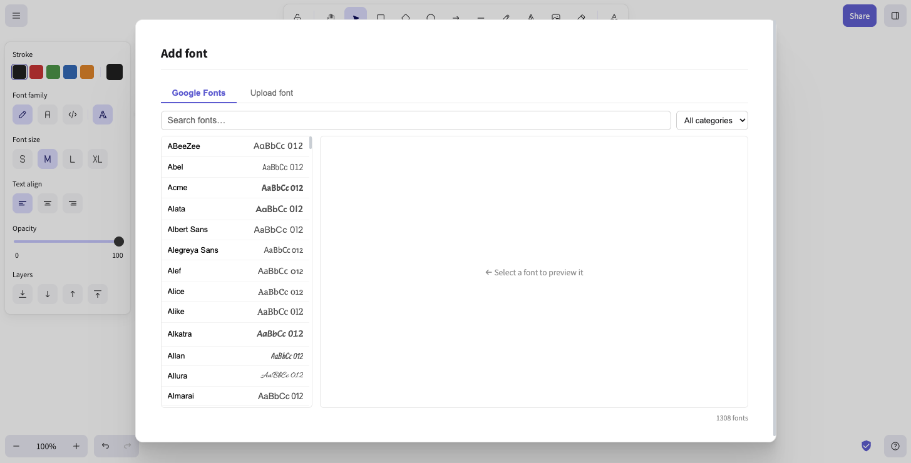

<div align="center">
  <a href="https://excalidraw.com/" target="_blank" rel="noopener">
    <picture>
      <source media="(prefers-color-scheme: dark)" srcset="https://excalidraw.nyc3.cdn.digitaloceanspaces.com/github/excalidraw_github_cover_2_dark.png" />
      
    </picture>
  </a>
</div>

<div align="center">
  <h1>Wobble — Extended Fork</h1>
  <p><strong>A fork of <a href="https://github.com/excalidraw/excalidraw">Excalidraw</a> with new features built on top of the original open-source whiteboard.</strong></p>
</div>

<br />

> **Standing on the shoulders of giants** — Excalidraw is an incredible open-source project built by an amazing community. This fork extends it with additional features while staying true to its spirit of simplicity and openness. Huge thanks to everyone at [excalidraw/excalidraw](https://github.com/excalidraw/excalidraw) for creating such a solid foundation.

<br />

<div align="center">
  <a href="https://excalidraw.com" target="_blank" rel="noopener">
    
  </a>
  <p align="center"><em>Create beautiful hand-drawn diagrams, wireframes, or whatever you like.</em></p>
</div>

---

## What's New in This Fork

This fork ships two major features on top of the upstream Excalidraw:

### 1. Google Fonts Picker

Typography matters. This fork integrates a **Google Fonts Picker** directly into the editor, giving you access to hundreds of fonts without leaving your canvas.

- Browse and search the full Google Fonts library from within the editor
- Apply any font to your text elements instantly
- Font preferences persist across sessions
- Works seamlessly with Excalidraw's existing text tools

No more being stuck with the default font selection — pick the perfect typeface for your diagram, wireframe, or illustration.

<div align="center">
  
</div>

### 2. IndexedDB Storage Upgrade

The original Excalidraw stores drawings in `localStorage`, which has a strict 5MB cap. This fork replaces that with **IndexedDB-backed storage**, unlocking significantly larger drawings without hitting browser limits.

- Store drawings that far exceed `localStorage` constraints
- Autosave still works seamlessly in the background
- No data migration needed — existing drawings load as before
- More reliable persistence for complex, asset-heavy canvases

---

## Core Excalidraw Features

Everything you love about the original is still here:

- **Infinite canvas** — pan and zoom freely
- **Hand-drawn style** — unique sketchy aesthetic out of the box
- **Dark mode** — easy on the eyes
- **Export** — PNG, SVG, clipboard, or `.excalidraw` JSON
- **Shape library** — rectangles, circles, diamonds, arrows, free-draw, and more
- **Arrow binding** — smart connectors with labels
- **Undo / Redo** — full history
- **i18n** — localization support
- **Image support** — embed images directly on the canvas
- **Offline-ready** — PWA support

---

## Getting Started

### Run Locally

```bash
yarn
yarn start
```

### Install as a Package

```bash
npm install react react-dom @excalidraw/excalidraw
# or
yarn add react react-dom @excalidraw/excalidraw
```

See the [upstream documentation](https://docs.excalidraw.com/docs/@excalidraw/excalidraw/installation) for full integration details.

---

## Credits & Appreciation

This project would not exist without the incredible work of the Excalidraw team and its open-source contributors. The original project is:

- Built with care and love by the [Excalidraw community](https://github.com/excalidraw/excalidraw/graphs/contributors)
- Licensed under the [MIT License](https://github.com/excalidraw/excalidraw/blob/master/LICENSE)
- Used by Google Cloud, Meta, CodeSandbox, Replit, Notion, and many more

If you find value in Excalidraw, consider [sponsoring the original project](https://opencollective.com/excalidraw) or using [Excalidraw+](https://plus.excalidraw.com/).

---

## License

MIT — same as the upstream project.
